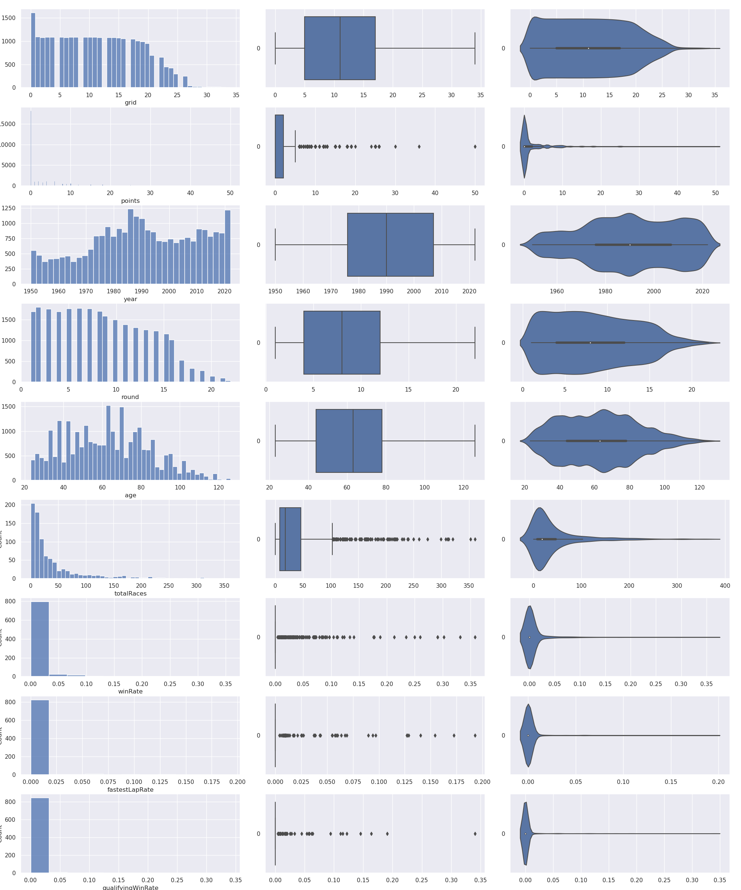

# SC1015: Data Science Mini Project - Formula One Future 

School of Computer Science and Engineering \
Nanyang Technological University \
Lab: A121 \
Group : 3 

Members: 
1. Dang Huy Phuong ([@DKER2](https://github.com/DKER2))
2. Clara Heng Yih Xian ([@claraheng](https://github.com/claraheng))

---
### Description:
This repository contains all deliverable: the Jupyter Notebooks, datasets, images, presentations slide, and the source materials/references we have used and created as part of the Mini Project for SC1015: Introduction to Data Science and AI. 

This README briefly highlights what we have solved in this project. To gain a more comprehensive understanding of our accomplishments and the underlying details, please refer to the Jupyter Notebooks located within this repository.

---
### Table of Contents:
1. [Problem and Objective](#1-Problem-and-Objective)
2. [Data Preparation and Cleaning](#2-Data-Preparation-and-Cleaning)
3. [Exploratory Data Analysis](#3-Exploratory-Data-Analysis)
4. [Supervised Method](#4-Supervised-Method)
5. [Unsupervised Method](#5-Unsupervised-Method)
6. [Data Driven Insights and Conclusion](#6-Data-Driven-Insights-and-Conclusion)
---
### 1. Problem and Objective

**Our Dataset:** [Formula 1 World Championship (1950 - 2023)](https://www.kaggle.com/datasets/rohanrao/formula-1-world-championship-1950-2020) \
**Our Question:** 
Which driver will finish in the top position in the Driver’s Championship at the end of the season and which of the new drivers have the potential to become a top F1 driver?

**Description**: Within the dataset for Formula 1, there are several CSV files, each of which stores a distinct piece of information related to the sport. These files include circuits.csv, results.csv, and drivers.csv etc. The dataset is frequently updated and contains data spanning from 1950 to the present day. 

### 2. Data Preparation and Cleaning
In this section of the project, we prepped and cleaned the dataset to help us analyze our data better and also to help us use our data for the purposes of machine learning in the later sections. 

We performed the following:
1. **Feature Selection:** We only select relevant data related to our question, such information as driver description is eliminated. 
2. **Eliminate Uncompleted Data**: We elimate all uncompleted data in year 2022 and 2023
3. **Dropping `NaN`s**: All the `NaN` values were dropped or replaced. 
4. **Feature Engineer**: Because there are a lot of variable, we grab it to some valuable variables such as Age, Winrate. 

### 3. Exploratory Data Analysis
In this section, we try to investigate and summarize the main characteristics of the dataset to gain understanding of the data and uncover any insights or patterns. In this section, we also apply some visualization technique to make the statistic more meaningful.

For further findings and explanations, please refer to the Jupyter Notebook on EDA.

### 4. Supervised Method
Here we utilized three Supervised Methods to predict driver's performance:
1. Linear Regression
2. Polynomial Regression
3. Deep Neural Multilayer Perceptron

### 5. Unsupervised Method
Here we utilize unspervised methods to cluster group of driver:
1. Kmeans Cluster
2. DBSCAN 

### 6. Data Driven Insights and Conclusion

## Outcome for Supervised Learning
* Due to the high model accuracy obtained, we can confidently use our model to predict Which driver will finish in the top position in the Driver’s Championship at the end of the season based on their past performance.
* This information might be helpful for teams to predict their drivers’ performance ahead of time, allowing them to plan ahead for their future driver lineups to maximise their success.

## Outcome for Unsupervised Learning
Using K-means and DBSCAN clustering, we produced 2 models to cluster our drivers. They predicted different clusters, and we could owe it to the difference in their algorithms.
* K-means clustering is not ideal for categorical data, as it assumes continuous data, in which k-modes clustering could be used instead.
* Different clustering algorithms have different strengths. DBSCAN is density-based and can find clusters of any shape, while K-means is centroid-based and requires specifying the number of clusters.
* After predicting which cluster our newer drivers would be, it was interesting to see that while K means predicted that none of the newer drivers shares the same characteristics as top drivers, DBSCAN does.
* However, F1 drivers vary in so many traits that we feel like the spread of each cluster was too big and it encompassed too many different demographics of drivers, thus it might not be accurate to say that they all have the potential to become successful drivers.

## Data-driven Insights
* Based on the correlation matrix, the points obtained by the driver are highly correlated to the age and grid of the driver, 0.25 and 0.37, respectively.
* Based on the DBSCAN clustering model,  the average age of the top cluster was 59. When compared to the other cluster’s 84, it may show that younger drivers are more likely to win more often than older drivers.
* Highlight to teams: focus on the potential of younger drivers and placing well in qualifying races.

## Main learning points
* Polynomial regression could result in a better fit on the training set, but it risks worse performance on the validation set
* It is very important to prepare data properly for clustering
* Learnt more about the different types of clustering models and their algorithms
